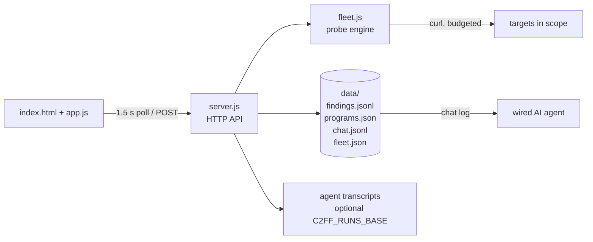

<div align="center">


**Autonomous, 100% local bug bounty hunting console**

Fleet probing engine, findings database, program management and agent coordination - in a single Node process, with no API tokens, no quotas and no cloud.

[](LICENSE)
[](https://nodejs.org)
[](#architecture)
[](#)

[Overview](#overview) · [Features](#features) · [The engine](#the-engine) · [Quick start](#quick-start) · [Architecture](#architecture) · [Configuration](#configuration) · [Agent integration](#agent-integration) · [Security & ethics](#security--ethics) · [Roadmap](#roadmap) · [Contributing](#contributing)

</div>

---

## Overview

C2FF is a self-hosted hunting console for authorized bug bounty work (Bugcrowd, HackerOne, private VDPs). It runs entirely on your machine as one Node process and gives you:

- a **live fleet view** of your running agents and their streamed output,
- a **persistent findings database** with a triage workflow (`signal → analysis → submitted → duplicate/rejected/closed`),
- a **program registry** holding each program's scope, required researcher headers (e.g. `X-Bug-Bounty`) and credentials references,
- a **deterministic probing engine** that runs scheduled cycles entirely from your PC, and
- a private **coordination channel** you can wire to an AI agent (optional - everything works without one).

No accounts, no telemetry, no paid APIs. If it runs, it runs until you stop it - the bundled watchdog restarts the server automatically if it ever dies.

## Features

| Capability | What you get |
|---|---|
| Fleet view | Real-time cards per run and per agent, last output, expandable event feed |
| Findings triage | Severity (P1..P3/HIT/SIG), workflow statuses persisted to disk, manual entries |
| Programs | Declare scope, required headers, credential refs once - then launch playbooks in one click |
| Local engine | Deterministic probe cycles, strict request budget, dedup - zero LLM tokens |
| Coordination | Private chat channel between you and any agent wired to the log file |
| Survival | Watchdog loop keeps the console online indefinitely; restart with one `pkill` |

## The engine

The heart of C2FF is a pure-Node probing engine. Each cycle it sends a small, calculated set of `curl` requests, deduplicates results and writes findings to disk. No paid API, no rate-limit roulette, no tokens.

| Module | Detects | CWE |
|---|---|---|
| `SECHEADERS` | Missing protective headers, exposed stack | 693, 200 |
| `COOKFLAGS` | Cookies without Secure/HttpOnly | 614, 1004 |
| `CORS` | Arbitrary Origin reflected in ACAO | 942 |
| `OPTIONS` | Permissive preflight (DELETE/PUT) | 942 |
| `ERRLEAK` | Stack traces in errors | 209 |
| `DOTFILES` | Exposed `.git/config`, `.env`, server-status | 541, 538 |
| `TECHSIG` | Open WordPress REST, server fingerprints | 718, 200 |
| `ROBOTS` | Sensitive paths in robots.txt | 538 |
| `JSSECRETS` | AWS / Stripe / Google / GitHub / private keys in JS bundles | 798, 321 |

**Built-in guardrails**

- One representative host per wildcard in scope - never mass scanning
- Strict budget: 60 requests per cycle (configurable), 500 ms spacing
- Signal deduplication: identical evidence is stored once
- Every GET is read-only; per-program researcher headers are injected automatically
- Writes, session interactions and mass-scanner traffic are deliberately not implemented

## Quick start

```bash
git clone https://github.com/C2FF/C2FF.git
cd C2FF
./install.sh
```

That verifies Node and curl, creates the `data/` workspace, starts the server and arms the watchdog. Open **http://localhost:4181**.

Manual alternative:

```bash
node server.js 4181
```

Requirements: Node >= 18, curl, nothing else.

### Using the console

1. **Programmes** tab - register a program (id, name, required header, scope)
2. **Fleet panel** - press **Démarrer**; probe cycles run on their own, forever
3. **Cycle maintenant** - trigger an immediate cycle instead of waiting
4. **Findings** tab - signals arrive in real time; triage them with the status selector
5. **Coordination** tab - send instructions to your wired agent
6. Keyboard shortcuts `1-4` switch tabs; the UI polls every 1.5 s

### Stopping and restart behavior

The watchdog checks the port every 20 s and revives the server if needed. Stop everything with:

```bash
pkill -f 'C2FF/watchdog.sh' ; pkill -f 'C2FF/server.js'
```

## Architecture



`server.js` is the only process. `fleet.js` is the deterministic engine. `data/` is the entire state - copy it and you have moved your console.

## Configuration

C2FF is env-driven and path-free:

| Variable | Default | Purpose |
|---|---|---|
| `C2FF_PORT` | `4181` | HTTP port (also: first CLI argument) |
| `C2FF_RUNS_BASE` | empty | Optional directory of agent transcripts to sweep into the fleet view |

State files live in `data/`: `programs.json`, `findings.jsonl`, `chat.jsonl`, `fleet.json`.

## Agent integration

Everything in C2FF works without an AI agent. If you want deep agentic waves on top (recon-to-offensive pipelines, multi-hypothesis judges), wire your agent (e.g. Claude Code) to the coordination log:

```
data/chat.jsonl
{"t":1690000000,"from":"user","kind":"queue","playbook":"SQLI-DUO","program":"target","note":"..."}
{"t":1690000000,"from":"claude","kind":"chat","text":"verdict: ..."}
```

Your agent follows the queue, publishes verdicts back into the log, and they appear in the console instantly. Playbook templates and the agent rulebook: [docs/PLAYBOOKS-AGENTS.md](docs/PLAYBOOKS-AGENTS.md).

## Security & ethics

C2FF is built for **authorized** bug bounty programs only.

- Run cycles exclusively against domains in the official scope of your program
- Always send the researcher header your program requires
- All engine modules are slow-cadence, read-only GETs under typical anti-flood thresholds
- Destructive, write and scanner-like behavior is not implemented, by design

You are responsible for each program's rules. Test only what you are allowed to test.

## Roadmap

- [ ] Findings filters (severity, status) and text search
- [ ] One-click report export (markdown, ready to submit)
- [ ] Program editing from the UI
- [ ] Engine interval/budget configuration from the UI
- [ ] Per-module on/off toggle
- [ ] Authentication layer for remote access
- [ ] Docker image

## Contributing

PRs are welcome - see [CONTRIBUTING.md](CONTRIBUTING.md). For vulnerability reports in C2FF itself, see [SECURITY.md](.github/SECURITY.md).

## License

[MIT](LICENSE) - free to use, fork and ship.