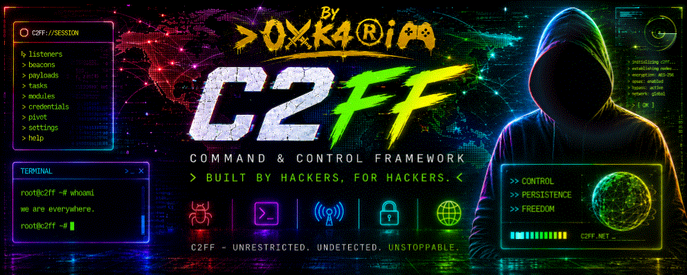
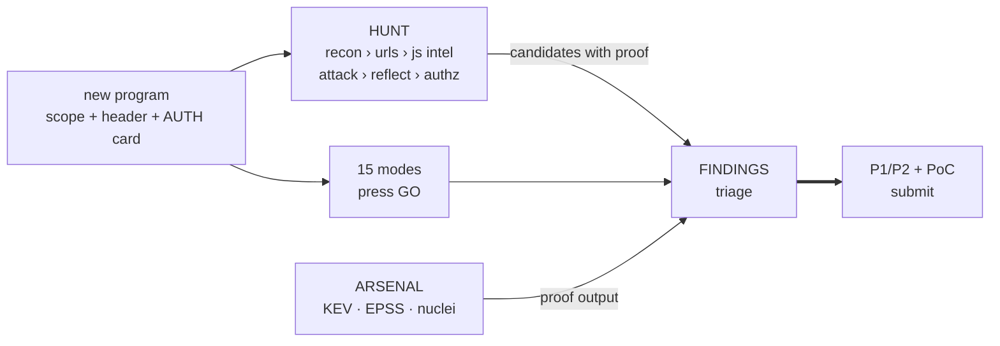

<div align="center">



# ⚡ C2FF

### The command & control console for your authorized hunts

**One Node process. Zero dependencies. Zero tokens. Zero cloud.**

[](LICENSE)
[](https://nodejs.org)
[](#quick-start)
[](#quick-start)
[](#console-tour)

<br>

**Declare a program → the pipeline lights up → signals become triaged findings →
findings become ready-to-submit PoCs.** Solo, or with your crew in one shared
room - roles, chat and live voice included.

<a href="#quick-start">🚀 Quick start</a> ·
<a href="docs/design-tour.html">🖼 Gallery</a> ·
<a href="#team-sessions">👥 Team</a> ·
<a href="#agent-integration">🤖 Agents</a>

</div>

---

## Why C2FF

> Every scanner sends requests. C2FF keeps **you** in command.

| | |
|:--|:--|
| 🎯 **One screen per target** | a permanent `SCOPE › RECON › ATTACK › ARSENAL › PLAN` banner follows your active program across every tab |
| 🔬 **Proof, not noise** | REFLECT / AUTHZ / ATTACK keep the captured **request + response** for every candidate, and write P1/P2 into the findings base with a 3-step PoC |
| 🧰 **Arsenal** | your recon'd stack matched against **CISA KEV / EPSS / Exploit-DB**, executed in one click through nuclei - with your researcher header |
| 🕸 **Team in one click** | open the same console to your crew over LAN or a verified public tunnel - room key, 5 grades, chat, WebRTC voice mesh |
| 🌍 **82 languages** | the whole UI, fully translated, RTL included - switch instantly from the header |
| 🫁 **Read-only by design** | slow-cadence GETs only, budgets, dedup - the writing, the judgment and the business logic stay yours |

## Quick start

```bash
git clone https://github.com/C2FF/C2FF.git
cd C2FF
./install.sh          # or: node server.js 4181
```

Open **http://localhost:4181** - that's the whole install. Requirements: Node ≥ 18, curl. Optional: `cloudflared` for public tunnels, `nuclei` for ARSENAL exec.

> 🖼 **See it before you run it** - the [console gallery](docs/design-tour.html): real screenshots of all eight tabs, arrow-key navigation, drag to pan, wheel to zoom.

## The console, in one screen

Eight tabs (keys `1-8`), one permanent pipeline banner:

| Tab | One line |
|:--|:--|
| **PROGRAMMES** | register scope + required header, pick one of 15 modes, press `GO` |
| **HUNT** | the working view: RECON · URLS · JS INTEL · ATTACK · REFLECT · AUTHZ · AUTH · PLAN, arsenal moves, findings - one target |
| **FINDINGS** | live signals base, persistent triage, `AI »` second opinion, one-click markdown PoC export |
| **FAST** | recon-lite on any URL without registering a program - ephemeral, admin-only |
| **IA** | optional LLM gateway (OpenAI-compatible / Ollama / Anthropic) |
| **TERM** | private shell per member + shared group terminal - every command signed, sandboxed (Docker caps), shareable into a challenge chat |
| **TEAM** | the room: 3 access levels, members, grades, session chat, audio mesh |
| **COORDINATION** | private channel toward your wired agent |

### One hunt, end to end



<details>
<summary><b>⚙️ Configuration & data</b></summary>

<br>

| Variable | Default | Purpose |
|---|---|---|
| `C2FF_PORT` | `4181` | HTTP port (also: first CLI argument) |
| `C2FF_BIND` | `127.0.0.1` | listen address (`0.0.0.0` = LAN, or set from the TEAM tab) |
| `C2FF_RUNS_BASE` | empty | optional directory of agent transcripts swept into the fleet view |
| `NUCLEI_BIN` | auto-detected | path to `nuclei` for ARSENAL exec |

The entire state lives in `data/`: programs, findings (`findings.jsonl`), per-program surface / urls / jsint / attack / modules / plan / arsenal, team room config, chat log, AI gateway config. **Copy `data/` and you have moved your console.**

</details>

<details>
<summary><b>🧭 The 21 probe modules</b></summary>

<br>

| Module | Detects | Module | Detects |
|---|---|---|---|
| `SECHEADERS` | missing headers, exposed stack | `JWTSPOT` | JWTs + lab axes (287/347) |
| `COOKFLAGS` | cookies without Secure/HttpOnly | `IDORSCAN` | client-side BOLA refs (639) |
| `CORS` / `OPTIONS` | reflected ACAO, permissive preflight | `UPLOADSPOT` | upload surfaces (434) |
| `XSSDUST` | unencoded reflection (79) | `JSSECRETS` | AWS/Stripe/GitHub keys in bundles |
| `SQLIMAP` | SQL errors on quotes (89) | `ERRLEAK` | stack traces (209) |
| `TRAVFILE` | path traversal, dotfiles (22…) | `TECHSIG` / `ROBOTS` | fingerprints, sensitive paths |
| `SSRFPROBE` | URL-accepting params (918) | `EXPOSED` | unprotected consoles (284) |
| `REDIRCHECK` | open redirects (601) | `XMLSPOT` | XXE surfaces (611) |
| `SSTIMARK` / `CMDIMARK` | `{{7*7}}`, command markers | `+ 2` | fleet dedup, baseline diff |

15 one-click modes compose them (FULL SWEEP + one mode per CWE family). The full playbook table for agents: [docs/PLAYBOOKS-AGENTS.md](docs/PLAYBOOKS-AGENTS.md).

</details>

## Team sessions

One click turns the solo console into a shared room:

- **3 levels** : `LOCAL` (loopback, no auth) → `LAN` (**OPEN TO NETWORK**, room key) → `WORLD` (verified `trycloudflare` tunnel, HTTPS, key enforced - tunnel traffic is never treated as loopback)
- members join with one link: unique handle + PIN, admin-validated queue, 5 grades (`admin › co-admin › hunter › member › observer`)
- **session chat** with dedicated per-event chats (a challenge opens its own participants-only channel, with a findings limit enforced server-side), private **coordination** channel, **WebRTC voice mesh** - peer-to-peer, server relays signalling only
- `REGENERATE KEY` kills every old invite instantly; a kicked handle is blocked at the next heartbeat

## Agent integration

Everything works without an agent. To wire one in, it lives on the coordination log:

```
data/chat.jsonl
{"t":1690000000,"from":"hunter","kind":"queue","playbook":"SQLI-DUO","program":"target","note":"..."}
{"t":1690000000,"from":"claude","kind":"chat","text":"verdict: ..."}
```

Your agent follows the queue, publishes verdicts back, they appear instantly. Rulebook + playbooks: [docs/PLAYBOOKS-AGENTS.md](docs/PLAYBOOKS-AGENTS.md).

## Security & ethics

C2FF is built for **authorized** bug bounty programs only: scope-checked probes, researcher headers injected per program, slow read-only GETs under anti-flood thresholds - writes and mass scanning are not implemented, by design. You are responsible for each program's rules.

Found a hole in C2FF itself? Open an issue marked `security` and keep the details minimal until a maintainer replies. PRs welcome - [CONTRIBUTING.md](CONTRIBUTING.md).

---

<div align="center">

**MIT** - free to use, fork and ship. Test only what you are allowed to test.

</div>