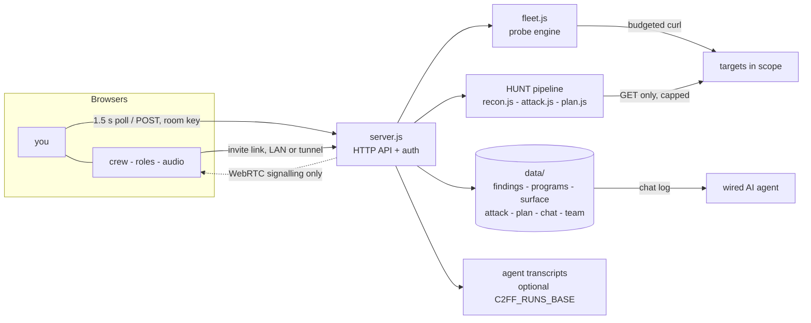
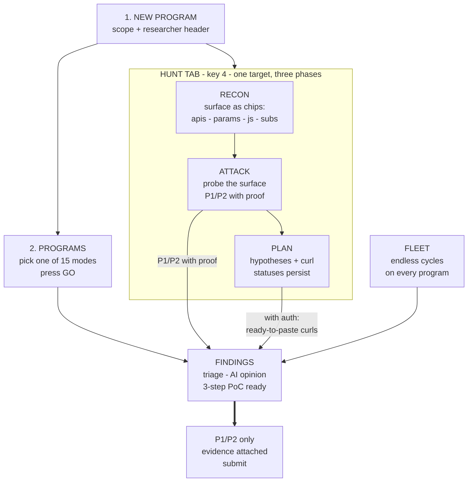

<div align="center">


# C2FF

**Command & Control Framework - autonomous bug bounty console, 100% local**

Fleet probing, findings triage, program management, agent coordination and multi-player sessions - in one Node process. No API tokens, no quotas, no cloud, no telemetry.

[](LICENSE)
[](https://nodejs.org)
[](#quick-start)
[](#quick-start)
[](#console-tour)

[The stack](#the-stack-at-a-glance) · [Session levels](#three-levels-of-access) · [The engine](#the-engine) · [Quick start](#quick-start) · [Console tour](#console-tour) · [Team sessions](#team-sessions) · [Agent integration](#agent-integration) · [Architecture](#architecture) · [Security & ethics](#security--ethics) · [Roadmap](#roadmap)

</div>

---

C2FF is the console where an authorized hunt actually lives:

- you declare a **program** (scope + researcher header), pick one of **15 modes**, and the local engine probes on a budget
- every signal lands in a **findings base** with a persistent triage workflow
- your agents stream their output into the **fleet view**, and can be driven from a private **coordination channel**
- when you hunt **as a team**, one click opens the same console to your crew, with roles, live audio and a session chat

It is deliberately **not** another headless scanner: C2FF keeps a human in command, sends slow read-only probes only, and leaves authenticated business-logic work to you (and your agent).

## The stack, at a glance

| Layer | What runs | Where |
|---|---|---|
| Console | `index.html` + `app.js` - terminal-look UI, no framework, 12 fully translated languages | your browser |
| Core | `server.js` - HTTP API, auth rooms, roles, tunnel control, audio signaling | one Node process |
| Engine | `fleet.js` - 21 deterministic probe modules, budgeted cycles | `curl`, local |
| Hunt | `recon.js` + `attack.js` + `plan.js` - surface mapping, targeted probes, work plan | `https`, local |
| State | `data/*.json*` - findings, programs, surface, attack, plan, chat, team, AI gateway | your disk |
| Watchdog | `watchdog.sh` - port check loop, auto-revive | your shell |

Dependency-free JavaScript only. If you can run Node, you can run C2FF.

> **Before you install:** browse the [console gallery](docs/design-tour.html) - real screenshots of all eight tabs, navigable with the arrow keys; drag any image to pan it (grab cursor), wheel to zoom.

## Three levels of access

The SESSION tab flips the console between solo and shared, without restarting anything yourself:

| Level | Trigger | Reach | Auth |
|---|---|---|---|
| **LOCAL** | default | `127.0.0.1` only | none needed (you are on loopback) |
| **LAN** | **OPEN TO NETWORK** | your machine re-binds to `0.0.0.0` via self-respawn (~2 s) | room key on every API route |
| **WORLD** | **OPEN TO WORLD (tunnel)** | a public `trycloudflare.com` URL, valid from any network | room key, HTTPS, audio-capable |

- The tunnel is opened and **auto-verified** by the server (cloudflared must be installed); the invite link is only displayed once it actually answers
- The invite link is a single click away - a **COPY** button sits next to both the local invite and the tunnel URL
- **REGENERATE KEY** instantly kills every old invite link, LAN and WORLD alike

### What a member can do inside the room

- see the fleet, the findings base and every probe signal, live
- chat in the dedicated **session channel** (separate from the private coordination channel)
- speak through the **audio mesh**: peer-to-peer WebRTC voice between all members (HTTPS required - WORLD tunnel or localhost)
- manual findings and triage moves are stamped with their handle

### Roles: admin / guest

- every loopback client is **admin**; remote members start as **guest**
- admins promote guests to admin or **KICK** them: the kicked handle is blocked from the room and its next heartbeat is refused (click again to unblock)
- bind and tunnel decisions are accepted from localhost only - a room member can never re-bind or re-expose your server

## The engine

Each cycle, the engine sends a small, calculated set of budgeted `curl` probes, deduplicates signals and writes findings to disk.

| Module | Detects | CWE |
|---|---|---|
| `SECHEADERS` | Missing protective headers, exposed stack | 693, 200 |
| `COOKFLAGS` | Cookies without Secure/HttpOnly | 614, 1004 |
| `CORS` / `OPTIONS` | Arbitrary Origin reflected in ACAO, permissive preflight | 942 |
| `XSSDUST` | Reflected user input without encoding | 79 |
| `SQLIMAP` | SQL errors on quote payloads | 89 |
| `TRAVFILE` | Path traversal via params, dotfiles | 22, 98, 541, 538 |
| `SSRFPROBE` | Params accepting arbitrary URLs | 918 |
| `REDIRCHECK` | Open redirects via navigation params | 601 |
| `SSTIMARK` / `CMDIMARK` | Template evaluation (`{{7*7}}`), command markers | 1336, 78 |
| `XMLSPOT` | XML/SOAP surfaces for out-of-band XXE testing | 611 |
| `JWTSPOT` | JWTs in headers/cookies/bundles + lab axes | 287, 347 |
| `IDORSCAN` | Client-side object references (BOLA) | 639 |
| `UPLOADSPOT` | Upload surfaces to bypass | 434 |
| `JSSECRETS` | AWS / Stripe / Google / GitHub / private keys in JS bundles | 798, 321 |
| `ERRLEAK` | Stack traces in errors | 209 |
| `TECHSIG` / `ROBOTS` | Fingerprints, WordPress REST, sensitive paths in robots.txt | 718, 200, 538 |
| `EXPOSED` | Unprotected consoles and admin interfaces | 284 |

### Modes

Modules compose into **15 one-click modes** (Programs tab > `GO`): FULL SWEEP covers everything; XSS, SQLI, LFI, SSRF, OPEN-REDIR, SSTI/RCE, XXE, AUTH/JWT, BOLA/IDOR, UPLOAD, SECRETS, INFO-LEAK, EXPOSED and SEC-CFG each target one CWE family. The full playbook table for agents lives in [docs/PLAYBOOKS-AGENTS.md](docs/PLAYBOOKS-AGENTS.md).

Families that need authenticated sessions or business-logic judgment (CSRF mass, race conditions, payment flows) are deliberately not probed automatically - that is where the optional AI gateway and your own hands take over.

### The hunt, in three phases

The **HUNT tab** (key `4`) is where a selected target actually gets worked - pick a program, then walk its pipeline:

| Phase | What happens | Output |
|---|---|---|
| **RECON** | crawls the real surface: pages, JS bundles, API endpoints, query params, tech stack, subdomains via crt.sh | `data/surface.json` - visualized as labeled chips |
| **ATTACK** | probes that surface: unauthenticated APIs, reflected CORS, decoded JWTs (alg=none, kid traversal, no exp), exposed docs/config (`.env`, swagger, actuator, graphql, `.git`), secrets in bundles | candidates with proof, P1/P2 auto-injected into findings with a 3-step PoC |
| **PLAN** | turns the surface into a work plan: numbered hypotheses, each with a one-line "why" and a ready `curl` (program header included) | safe ones run in one click with the captured response; auth-required ones (IDOR with your token) are copy-paste ready |

Every plan line carries a status - todo / tested / signal / confirmed / nothing - persisted in `data/plan.json`, so the hunt accumulates across sessions. Budget stays strict: max 70 requests per ATTACK, GET only, 250 ms spacing.

**Built-in guardrails**

- one representative host per wildcard in scope - never mass scanning
- strict budget: 60 requests per cycle (configurable), 500 ms spacing
- signal deduplication: identical evidence is stored once
- every GET is read-only; per-program researcher headers are injected automatically
- writes, session interactions and mass-scanner traffic are not implemented, by design

## Quick start

```bash
git clone https://github.com/C2FF/C2FF.git
cd C2FF
./install.sh
```

That verifies Node and curl, creates the `data/` workspace, starts the server and arms the watchdog. Open **http://localhost:4181**.

Manual alternative:

```bash
node server.js 4181
```

Requirements: Node >= 18, curl. For the WORLD tunnel: `cloudflared` (optional).

### Stopping and restart behavior

The watchdog checks the port every 20 s and revives the server if needed - including after a LAN/LOCAL re-bind. Stop everything with:

```bash
pkill -f 'C2FF/watchdog.sh' ; pkill -f 'C2FF/server.js'
```

## Console tour

1. **PROGRAMS** - register a program (name, required header, scope), pick a mode, press **GO** - or jump straight into its hunt
2. **HUNT** - the three-phase pipeline (RECON, ATTACK, PLAN) on one program, with its findings underneath - the working view of a target (details above)
3. **FLEET** - press START; probe cycles run on their own, forever. CYCLE NOW triggers an immediate round
4. **FINDINGS** - signals arrive in real time; triage with the status selector, add manual findings, ask the AI for a second opinion with the `AI »` button
5. **SESSION** - your handle, the room, the three access levels, members with roles, session chat and the audio mesh (detailed below)
6. **COORDINATION** - private channel toward your wired agent
7. **AI** - optional gateway config (OpenAI-compatible / Ollama / Anthropic), one-click connection test
- the header language selector switches the whole UI instantly (80 entries, 12 fully translated, RTL for Arabic/Hebrew/Farsi/Urdu/Pashto/Sindhi); keys `1-8` jump between tabs; the UI polls every 1.5 s

## Team sessions

Team mode turns the solo console into a shared room: a generated key gates every API route, members invite themselves with one link, and every action is attributed. Full walkthrough:

1. SESSION tab - choose a handle (max 16 chars), set the room name, turn it ON, apply
2. **OPEN TO NETWORK** - the server re-binds to `0.0.0.0` via self-respawn (2 s, watchdog-safe) and the invite link shows your real LAN address
3. Or **OPEN TO WORLD** - a public tunnel URL is generated, verified, then shown with its own COPY button; share it anywhere
4. Invited members open the link, pick a handle, and join: live member list with role, presence and request count
5. As admin you switch roles and kick troublemakers; regenerating the key removes everyone at once
6. Enable the mic for the WebRTC audio mesh - voice is peer-to-peer between browsers, the server only relays signalling for 30 s windows

Why the tunnel is safe: tunnel traffic arrives locally through the built-in proxy and is never treated as loopback, so the room key applies exactly as if members came from outside. No port forwarding, no firewall hole - closing the tunnel restores LAN/LOCAL in one click.

## Agent integration

Everything in C2FF works without an AI agent. If you want deep agentic waves on top (recon-to-offensive pipelines, multi-hypothesis judges), wire your agent to the coordination log:

```
data/chat.jsonl
{"t":1690000000,"from":"user","kind":"queue","playbook":"SQLI-DUO","program":"target","note":"..."}
{"t":1690000000,"from":"claude","kind":"chat","text":"verdict: ..."}
```

Your agent follows the queue, publishes verdicts back into the log, and they appear in the console instantly. Playbook templates and the agent rulebook: [docs/PLAYBOOKS-AGENTS.md](docs/PLAYBOOKS-AGENTS.md).

The optional LLM gateway (AI tab) is separate and simpler: it analyses one finding on demand (the `AI »` button) and posts the answer into COORDINATION. Endpoint config stays in `data/ai.json` and never leaves your machine except toward the endpoint you set.

## Architecture



`server.js` is the only process. `fleet.js` is the deterministic engine, `recon.js` + `attack.js` + `plan.js` are the hunt pipeline. `data/` is the entire state - copy it and you have moved your console.

### The design, as a map

The same flow, from the hunter's seat - what you click, in order. And when you want to *see* it before installing: [docs/design-tour.html](docs/design-tour.html), the console gallery - the eight real tabs of the running app, pannable and zoomable in the browser (open the file locally, or from any static server - GitHub renders it raw only).



## Configuration

C2FF is env-driven and path-free:

| Variable | Default | Purpose |
|---|---|---|
| `C2FF_PORT` | `4181` | HTTP port (also: first CLI argument) |
| `C2FF_BIND` | `127.0.0.1` | Listen address - `0.0.0.0` opens LAN access (also settable from the SESSION tab) |
| `C2FF_RUNS_BASE` | empty | Optional directory of agent transcripts to sweep into the fleet view |

State files live in `data/`:

| File | Holds |
|---|---|
| `programs.json` | registered programs: name, scope, required header |
| `findings.jsonl` | every signal and manual finding, with triage status |
| `team.json` | room config: enabled, room name, key, roles, blocked handles, live flag |
| `chat.jsonl` | coordination channel + team session messages |
| `surface.json` | per-program recon: pages, APIs, params, JS bundles, tech, subdomains |
| `attack.json` | per-program attack candidates with captured proof |
| `plan.json` | per-program work plan: hypotheses, statuses, captured evidence |
| `ai.json` | optional LLM gateway config |
| `fleet.json` | fleet engine state |

## Security & ethics

C2FF is built for **authorized** bug bounty programs only.

- run cycles exclusively against domains in the official scope of your program
- always send the researcher header your program requires
- all engine modules are slow-cadence, read-only GETs under typical anti-flood thresholds
- destructive, write and scanner-like behavior is not implemented, by design

You are responsible for each program's rules. Test only what you are allowed to test.

## Roadmap

- [x] Deterministic local engine, 21 probe modules, 15 modes
- [x] HUNT pipeline: RECON (surface mapping), ATTACK (targeted probes), PLAN (persistent work plan)
- [x] Findings base with persistent triage workflow
- [x] Optional LLM gateway (OpenAI-compatible / Ollama / Anthropic)
- [x] Team sessions: room key, LAN go-live/shore, presence, attribution
- [x] Session chat, admin/guest roles, kick + blocklist
- [x] WORLD tunnel (cloudflared) with auto-verified public invite
- [x] WebRTC audio mesh + UI in 80 language entries (12 fully translated)
- [ ] Findings filters (severity, status) and text search
- [ ] One-click report export (markdown, ready to submit)
- [ ] Per-module on/off toggle + engine budget from the UI
- [ ] Docker image

## Contributing

PRs are welcome - see [CONTRIBUTING.md](CONTRIBUTING.md). Found a hole in C2FF itself? Open a GitHub issue marked `security` and keep the details minimal until a maintainer replies.

## License

[MIT](LICENSE) - free to use, fork and ship.